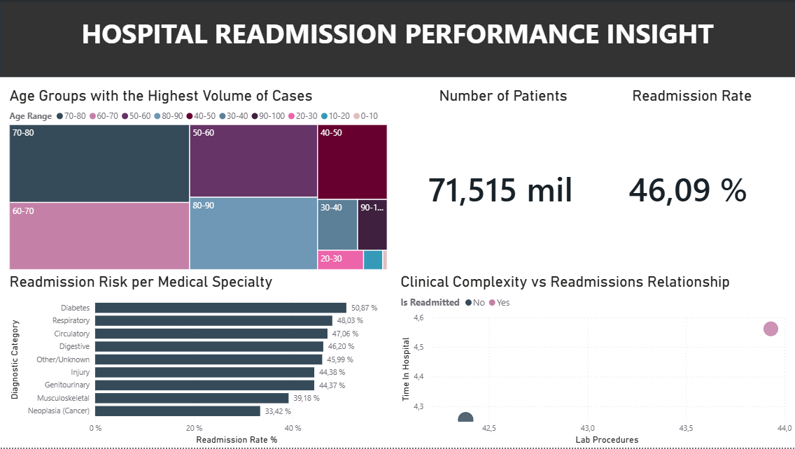

# Healthcare Analytics: Hospital Readmission Pipeline

## Project Overview

This project focuses on building a **data pipeline** to analyze hospital readmission patterns for diabetic patients across 130 US hospitals. Using **SQL (SQLite)**, I transformed a raw medical dataset into a structured analytical view to identify which diagnostic categories and medication factors contribute most to hospital readmissions.

## Tech Stack

* **Database:** SQLite (SQL)
* **ETL & Logic:** DBeaver (Data Cleaning, CASE statements, View creation)
* **Visualization:** Power BI (DAX Measures, Advanced Filtering, Interactive Dashboard)

## Data Pipeline

The analysis follows a professional **ETL (Extract, Transform, Load)** workflow:

1. **Data Ingestion:** Loaded 100k+ records of raw diabetic patient data.
2. **Transformation (SQL):** - Cleaned missing values (`?`) and standardized age ranges.
   - Mapped complex **ICD-9 codes** into 9 readable diagnostic categories (Circulatory, Digestive, etc.).
   - Implemented a **Production View** to decouple the analytical layer from raw data.
3. **Analytics (Power BI):** - Created DAX measures for dynamic **Readmission Rates**.
   - Designed a high-impact dashboard to correlate clinical effort with patient outcomes.

## Key Business Insights (KPIs)

* **The Complexity Paradox:** Patients who are readmitted show higher clinical intensity—averaging **4.6 days** in hospital and **44 lab tests**, compared to 4.2 days and 42 tests for those who didn't. This indicates that longer stays and more testing are markers of high-risk cases.
* **Critical Specialties:** Circulatory and Respiratory diagnoses exhibit the highest volume of returning patients, suggesting a need for specialized post-discharge follow-up.
* **Demographic Focus:** The **70-80 age group** represents the most significant strain on hospital resources, requiring targeted geriatric transition programs.

## Dashboard Preview
 

## Repository Structure
* `/sql`: `medical_analysis_pipeline.sql` (Full transformation script).
* `/docs`: Source dataset information.
* `/docs/healthcare project.pbix`: The interactive Power BI dashboard.

---
**Developed by:** Luis Monasterios 

**Let's connect:** https://www.linkedin.com/in/luis-monasterios-aa369a17b/

